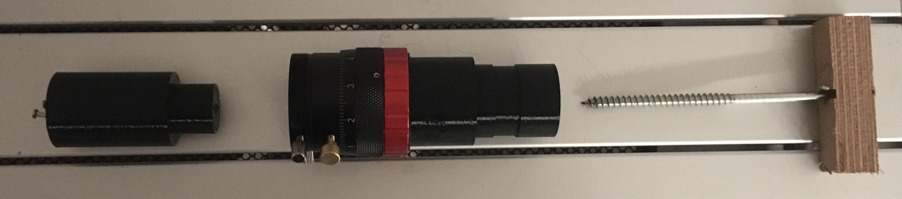

# Build Report for a Sol'ex Spectroheliograph
by Jens Scheidtmann

## Introduction
Christian Buit created a Do-It-Yourself 3D-print spectroheliograph, see its presentation and build instructions here:
http://www.astrosurf.com/solex/sol-ex-presentation-en.html. 

This build-log reports on my attempt at building it in the form of a diary. I hope this will be useful for others, so that my 
experience will help others. 

### License

This work is licensed under the Creative Commons Attribution-ShareAlike 4.0 International License. See file LICENSE for details.

## Building the Sol'ex

### 2022-01-12
The Shelyak kit arrived: Got the lenses, the diffraction grating, the slit and additional items for building a Star'ex. 
It's the [kit from Shelyak](https://www.shelyak.com/produit/es0027-solex-and-starex-optical-kit/?lang=en).

M3 and M4 Screws are on the way. I ordered sets of M3 and M4 screws from 4 mm length up to 40 mm length and some 
additional larger washers. Mold insert nuts are M3 and M4 from Ruthex. Unfortunately I couldn't find a bill of material 
on the original site.   

Hopefully one roll of PETG
[black filament from dasfilament](https://www.dasfilament.de/filament-spulen/petg-1-75-mm/158/petg-filament-1-75-mm-schwarz?c=21) 
is enough.

### 2022-01-13
Read the DADOS Tutorials by [Bernd Koch](http://astrofoto.de/german/profil/fprofil.htm) available [here](https://www.baader-planetarium.com/de/blog/neue-tutorials-fuer-den-dados-spaltspektrografen/) on Baader's site (in German, english version available [here](https://www.unitronitalia.com/schede/Baader-Dados-tutorial.pdf - very slow download). Ordered a MegaMan lamp for callibration purposes.

### 2022-01-14
Ordered two [helical ZWO focusers](https://www.astroshop.eu/focusers/zwo-helical-focuser-1-25-/p,63166) and a T2-1.25" adapter.

### 2022-01-16
Conducted first prints with the PETG filament on a Flashforge Finder. The PETG is much more prone to warping, i.e. a raft and 
glue is mandatory. Hopefully I can print the large spectrometre body parts with-out too much warping.

These are the settings I used in FlashPrint 5.2.1: 
 - Extruder Temp: 230°C
 - Shells: 3
 - Infill: 60%
 - Infull-Type: Hexagons
 - Activate Raft: Yes  (used the other default settings) 

Today's printed parts (named as given in [this picture](http://www.astrosurf.com/solex/images/image-collee-701-1.webp)):
 - Interface tel. #1 (My T2-1.25" adapter fits snuggly, even on the first warped print)
 - Support fente #2
 - Bague collimateur #5
 - Support réseau #9
 - Patte réseau #10
 - Bague objective #11
 - Bague épaisseur #13
 - Raidisseur #14

Here's a picture of the parts:

We will see, if I need to reprint the rings (#5 and #11) as they have a little bit of warping.

The STL-files are [available on github](https://github.com/Vdesnoux/Sol-ex) and there are some extensions available in subdirs:
 - motorisation_fichiers, move the diffraction grating with a motor
 - cache_parasite, avoid scattered light in the sprectrometre body
 - vernier_reseau, a dial for more visually selecting the color that is centered in the cam. Couldn't find the print-out for that, yet.

There is also a mailing list (french mostly): https://groups.io/g/Solex-project, on which new developments/extensions are reported.

### 2022-01-17
Printing the upper body part. Unfortunately this large element experienced some warping. Fortunately, the body is large enough, so that the optical path is not affected by the warping. 

### 2022-01-18
Printing the lower body part. I made especially sure that a good layer of glue is present on the 3D-printing bed. 4 hours into the printing, one edge of the body had disconnected from the bed and warping developed, which is similar to the upper body part printed yesterday. Hopefully I am able to account for the warping with the screws. If needed, I will have to print something so that the "Radisseur" (stiffener) plate is at its expected position. 

### 2022-01-19
Printed the two tubes (#4 and #12) and the collimator block (#3). The helical focusers and the T2-adapter arrived. Now everything is there to finish the Sol-ex.

The grating holder did not fit into the body part, so I had to sand the opening and the grating holder. I also sanded the body parts where they are in contact, in order get a tight fit. The T2-adapter fits nicely into the interface (#1). I printed it with-out raft (and it had no warping) and with normal layer thickness.

So far I was unable to fit the focuser on the respective tube (#12). I should have printed it in "fine" setting, but did use the normal setting, as the T2 adapter fitted perfectly in part #1. The problem is that the tube-thread does not grip the thread in the focuser. Or when it does, it's only one side of the tube and the tube gets stuck after a couple of degrees. I will reprint this one using "fine" layer thickness and probably use another slicer that randomizes the start point of outer layers. Hopefully this I'll be finished with this tomorrow. I will not use a raft, but then may have some elefant foot, which I should be able to cure with a bit of sanding.

Using the candle method I installed all Ruthex M4 and M3 threaded inserts in the body parts. A few seconds in the candle was enough. 

The collimator block needs a tad more sanding on the telescope side, as a slight warping is present. I also need to sand the tube to make it fit in the openinig of the collimator block. The slit holder will need the same treatment. 

Assembled the grating. The holder is a snug fit for the grating: I had to apply quite some force to fully place it on the holder.
I had to press a bit to get it down all the way.

TODO: 
 - Print the tube for camera end: no raft, fine layer setting, randomize start point.
 - Sand collimator block
 - Sand slit holder
 - Sand tube for collimator block

### 2022-01-20
Printed the tube for the camera end: no raft, fine layer setting. Did not randomize start points.
I tried to print the disk to rotate the grating (#8). Unfortunately the infill set-up has been destroyed (or there's a bug in the slicer) and the disk has been printed with-out infill. So will need to repeat that tomorrow.

Sanded collimator block and slit holder. Now they fit easily into each other. Mounted the slit on the holder and the holder in the collimator block. I first tried using washers, but that didn't work out well. I should have watched the video, where no washers are present. 
 
The tube for the camera still does not fit nicely into the thread of the helical focuser. After half an hour of trying to get the tube in, I printed [a centering piece](https://cad.onshape.com/documents/316c2c867ffea37441e19b92/w/02e4e45af20289e9be0c906b/e/80cd2974380ce7f4b167423d) to contrain the axis and get it easier on the focuser ([STL is here](pics/centering_piece.stl)).

Place the centering piece in the hole of the optical tube, then fix it to the tube with a piece of wood and a screw long enough (see picture). Then place this in the ZWO helical focuser and the thread of the tube is constraint to be parallel to the focuser's thread. Apply some force to get the threads grip each other and then screw it in. In the end I used a pipe wrench to screw it all in, because it was really slippery in my hands and I was not able to create the needed torque. Then remove the screw with the wood and remove the centering piece (this is the state the picture shows). In my case, I did not make the 1.25" inch part long enough and it started turning in the focuser. I fixed that using two nails (note: the STL has been fixed to be longer, so you can grip it by hand or with a wrench).  

TODO:
 - Print disk for turning the grating. 
 - Collimate and assemble optical components.

Looks like a "first light" is possible tomorrow. Keep your fingers crossed.
